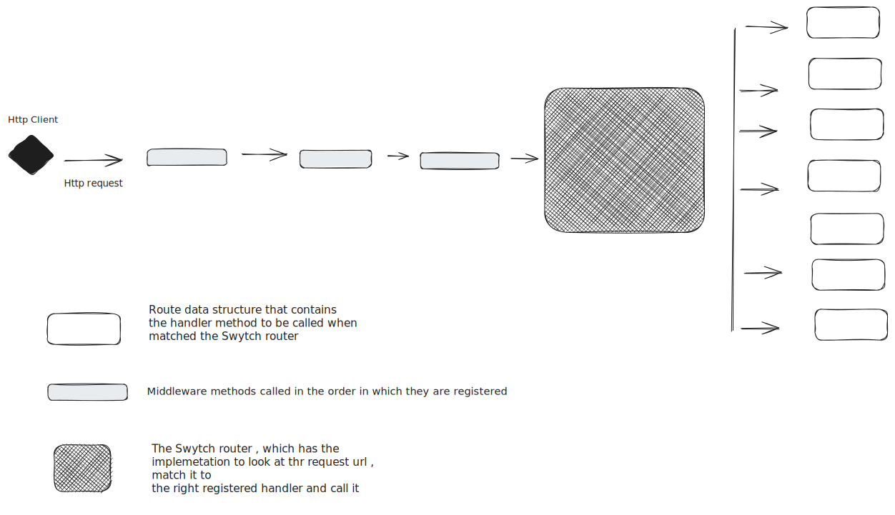

## The Swytch Architecture, Intro
> Devlog 26.06.24

*The Swytch architecture is a request processing pipeline made up of **middleware** functions , the
**Swytch router** and several registered **method refrences** that are dynamically invoked.*

#### An idea for a request processing pipeline

I thinkk it's funny how the decision to write an http router in C# was made minutes after reading about the 
concept of delegates in the language. At first i though "oh cool, a variable that can hold a method refrence" and 
then I continued reading and saw the part about a multicast delegate.
A way you could chain methods(delegates) and invoke them in order. 
>This example demonstrates how to create multicast delegates.
> A useful property of delegate objects is that multiple objects can be assigned to one delegate instance by using the + operator. 
> The multicast delegate contains a list of the assigned delegates.
> When the multicast delegate is called, it invokes the delegates in the list, in order. Only delegates of the same type can be combined.
[more](https://learn.microsoft.com/en-us/dotnet/csharp/programming-guide/delegates/how-to-combine-delegates-multicast-delegates)

First thing that came to mind was a pipeline an http request could travel through. At that point I had
no idea the existence of the amazing and convenient `HttpListener` server class but that didn't matter. If there was a
way to string together methods and have control over the execution sequence... sold! 
So yh , request processing pipeline for `Swytch` containing your middlewares and request handling logic
is basically me multicasting a `Action<Task,RequestContext>` delegate.

Although one thing I noticed and have had a challenge with from the begining is figuring out how I would break the chain of execution
if I wanted to. To be honest I have not spent enough time looking around on how to do this in a multicast 
delegate but doesn't seem too straightforward from where I sit. So if you have any idea or insights on how this is done kindly share with me.Figuring this out means a more convenient 
way to allow users to break out of the pipeline with implementations like auth middlewares etc.
Other than that we will have to take another approach like maybe setting a a flag on the request context in the middleware
and checking in your request handling method to decide if a user is authenticated or not, verbose but it will
work.

**The next feature**

i plan on working on is adding templating support to allow writing and generation of dynamic content as response, then maybe look at
convenient ways to quickly set up  connection to a datastore. Should be fun

